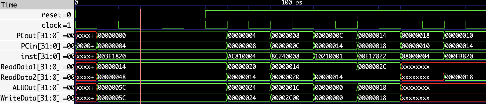
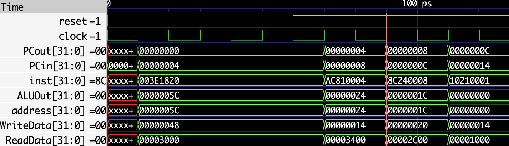
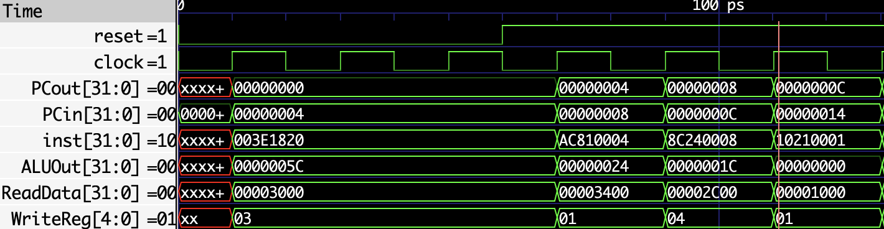
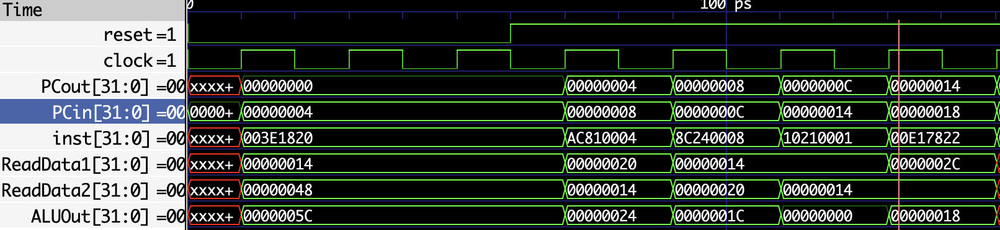
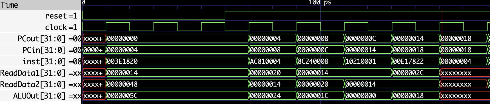
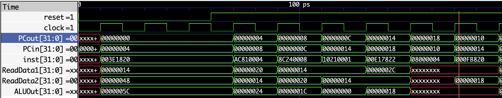
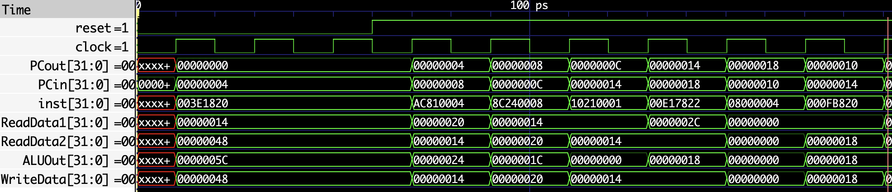

## Instructions

### `add`

The `add` instruction performs an addition of two registers and stores the result in a destination register. It is an R-type instruction.

**Example:**

| Machine code  | Instruction | 
|--------------|-----------------|
| 003E1820 | add R3, R1, R30        |

#### Breakdown:

| Opcode | rs     | rt     | rd     | shamt  | funct  |
|--------|--------|--------|--------|--------|--------|
| 000000 | 00001  | 11110  | 00011  | 00000  | 100000 |

#### Explanation:

1. **Opcode (6 bits):** The opcode for R-type instructions is always `000000`.
2. **Source Register 1 (rs) (5 bits):** This is the first source register. For `R1`, the binary representation is `00001`.
3. **Source Register 2 (rt) (5 bits):** This is the second source register. For `R30`, the binary representation is `11110`.
4. **Destination Register (rd) (5 bits):** This is the destination register. For `R3`, the binary representation is `00011`.
5. **Shift Amount (shamt) (5 bits):** This is the shift amount for shift instructions. For `add`, it is always `00000`.
6. **Function Code (funct) (6 bits):** This specifies the exact operation. For `add`, the function code is `100000`.

### `sw`

The sw (store word) instruction stores a word from a register into memory. It is an I-type instruction.

**Example:**

| Machine code  | Instruction | 
|--------------|-----------------|
| AC810004 | sw R1, 4(R4)        |

| Opcode | rs     | rt     | Offset  |
|--------|--------|--------|--------|
|101011	|00100	|00001	|0000000000000100|

#### Explanation:

1. **Opcode (6 bits):** The opcode for `sw` instructions is `101011`.
2. **Base Register (rs) (5 bits):** This is the base register. For `R4`, the binary representation is `00100`.
3. **Source Register (rt) (5 bits):** This is the source register. For `R1`, the binary representation is `00001`.
4. **Offset (16 bits):** This is the offset value. For `4`, the binary representation is `0000000000000100`.

### `lw`

The `lw` (load word) instruction loads a word from memory into a register. It is an I-type instruction.

**Example:**

| Instruction  | lw R4, 8(R1)   |
|--------------|----------------|
| Machine Code | 8C240008       |

#### Breakdown:

| Opcode  | rs     | rt     | Offset           |
|---------|--------|--------|------------------|
| 100011  | 00001  | 00100  | 0000000000001000 |

#### Explanation:

1. **Opcode (6 bits):** The opcode for `lw` instructions is `100011`.
2. **Base Register (rs) (5 bits):** This is the base register. For `R1`, the binary representation is `00001`.
3. **Destination Register (rt) (5 bits):** This is the destination register. For `R4`, the binary representation is `00100`.
4. **Offset (16 bits):** This is the offset value. For `8`, the binary representation is `0000000000001000`.

### `beq`

The `beq` (branch on equal) instruction compares two registers and branches to a specified address if they are equal. It is an I-type instruction.

**Example:**

| Instruction  | beq R1, R1, +1 |
|--------------|----------------|
| Machine Code | 10210001       |

#### Breakdown:

| Opcode  | rs     | rt     | Offset           |
|---------|--------|--------|------------------|
| 000100  | 00001  | 00001  | 0000000000000001 |

#### Explanation:

1. **Opcode (6 bits):** The opcode for `beq` instructions is `000100`.
2. **First Source Register (rs) (5 bits):** This is the first source register. For `R1`, the binary representation is `00001`.
3. **Second Source Register (rt) (5 bits):** This is the second source register. For `R1`, the binary representation is `00001`.
4. **Offset (16 bits):** This is the offset value. For `1`, the binary representation is `0000000000000001`.

In this instruction, `beq R1, R1, +1`:
- **Operation**: Compares the contents of registers `R1` and `R1`.
- **Branch**: If the contents are equal, the program branches to the address `PC + 4 + (1 * 4)`. This means it will execute the instruction located one word (4 bytes) after the next instruction.

### `sub`

The `sub` (subtract) instruction subtracts the value of one register from another and stores the result in a destination register. It is an R-type instruction.

**Example:**

| Instruction  | sub R15, R7, R1 |
|--------------|-----------------|
| Machine Code | 00E17822        |

#### Breakdown:

| Opcode  | rs     | rt     | rd     | shamt  | funct  |
|---------|--------|--------|--------|--------|--------|
| 000000  | 00111  | 00001  | 01111  | 00000  | 100010 |

#### Explanation:

1. **Opcode (6 bits):** The opcode for `sub` instructions is `000000`.
2. **First Source Register (rs) (5 bits):** This is the first source register. For `R7`, the binary representation is `00111`.
3. **Second Source Register (rt) (5 bits):** This is the second source register. For `R1`, the binary representation is `00001`.
4. **Destination Register (rd) (5 bits):** This is the destination register. For `R15`, the binary representation is `01111`.
5. **Shift Amount (shamt) (5 bits):** This is the shift amount, which is `00000` for this instruction as it does not involve any shifting.
6. **Function Code (funct) (6 bits):** The function code for `sub` is `100010`.

### `j`

The `j` (jump) instruction in MIPS is used to jump to a specified address. It is a J-type instruction.

**Example:**

| Instruction  | j +4           |
|--------------|----------------|
| Machine Code | 08000004       |

#### Breakdown:

| Opcode  | Address            |
|---------|--------------------|
| 000010  | 00000000000000000000000004 |

#### Explanation:

1. **Opcode (6 bits):** The opcode for `j` instructions is `000010`.
2. **Address (26 bits):** This is the target address for the jump, specified in the instruction.

To understand how the address is formed in the jump instruction, note that the address is constructed from the 26-bit immediate value, which is then shifted left by 2 bits (because MIPS instructions are word-aligned, meaning they are always at addresses that are multiples of 4). The final jump address is formed by combining the upper 4 bits of the current PC with the 26-bit immediate value (shifted left by 2 bits).

### `add`

The `add` instruction in MIPS adds the values of two registers and stores the result in a destination register. It is an R-type instruction.

**Example:**

| Instruction  | add R23, R0, R15 |
|--------------|------------------|
| Machine Code | 000FB820         |

#### Breakdown:

| Opcode  | rs     | rt     | rd     | shamt  | funct  |
|---------|--------|--------|--------|--------|--------|
| 000000  | 00000  | 01111  | 10111  | 00000  | 100000 |

#### Explanation:

1. **Opcode (6 bits):** The opcode for `add` instructions is `000000`.
2. **First Source Register (rs) (5 bits):** This is the first source register. For `R0`, the binary representation is `00000`.
3. **Second Source Register (rt) (5 bits):** This is the second source register. For `R15`, the binary representation is `01111`.
4. **Destination Register (rd) (5 bits):** This is the destination register. For `R23`, the binary representation is `10111`.
5. **Shift Amount (shamt) (5 bits):** This is the shift amount, which is `00000` for this instruction as it does not involve any shifting.
6. **Function Code (funct) (6 bits):** The function code for `add` is `100000`.

